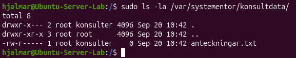
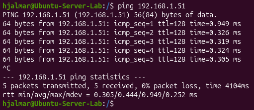
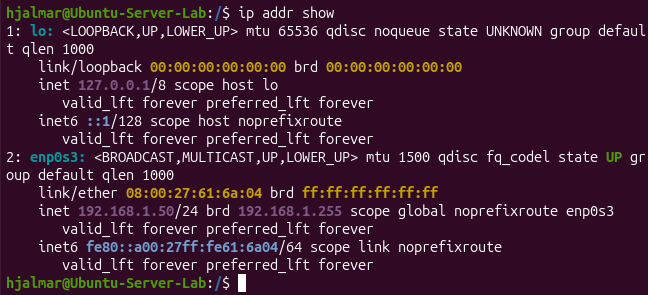
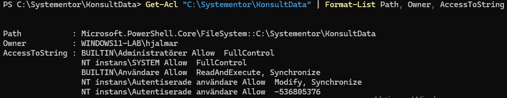
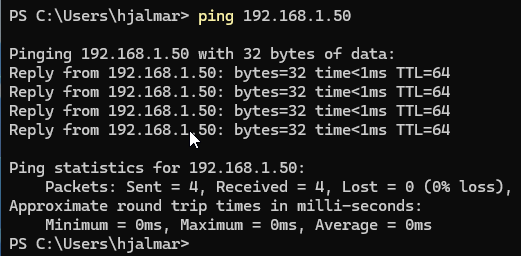

# Labbdokumentation: Labbmiljö, Git, CLI och AI
**Namn:** Hjalmar Niemi  
**Datum:** 15 september 2026,  
**Kurs:** Introduktion till yrkesrollen och grunderna i IT-infrastruktur

## Introduktion

Denna rapport dokumenterar uppsättningen och genomförandet av labbmiljön i uppgiften *Labbmiljö, Git, CLI och AI*. Syftet med denna laboration är att praktiskt tillämpa och demonstrera färdigheter inom nätverkskonfiguration, kommandon i Linux och Windows, versionhantering med Git samt kritisk granskning av AI

## Labbmiljö
Labbmiljön består av följande:
- **Linux-miljö:** Virtuell maskin med Ubuntu som körs via VirtualBox.
- **Windows-miljö:** Virtuell maskin med Windows11 som körs via VirtualBox.
- **Git/Github:** Versionshantering.
- **Visual Studio Code:** Dokumentation i Markdown.

## Nätverkstabell  
| Hostname | Operativsystem | IP-adress | Subnätmask | Standard Gateway |
| -------- | -------------- | --------- | ---------- | ---------------- |
| Ubuntu-Server-Lab | Ubuntu 26.04.1 LTS | 192.168.1.50 | 255.255.255.0 | Ej tillämpbart |
| Windows11-Lab | Windows 11 Home 25H2 | 192.168.1.51 | 255.255.255.0 | Ej tillämpbart |

## Kommandoradsarbete & Felsökning
### Linux
1. Skapa mappen /var/systementor/konsultdata och filen anteckningar.txt:
`sudo mkdir -p /var/systementor/konsultdata && sudo touch /var/systementor/konsultdata/anteckningar.txt`  

2. Skapa ny grupp `sudo groupadd konsulter`  
Gör gruppen konsulter till ägare över mappen /var/systementor/konsultdata samt alla filer/undermappar & ändra behörighet:  
```
sudo chown -R :konsulter /var/systementor/konsultdata
sudo chmod 750 /var/systementor/konsultdata
sudo chmod 640 /var/systementor/konsultdata/anteckningar.txt
```
Nu kan vi se att gruppen *konsulter* är ägare och behörighet ändrats:

  

`drwxr-x---` berättar att det är ett directory "d" och root har behörigheterna read, write, execute, "rwx". Gruppen "konsulter" har `r-x` behörighet samt "övriga" har inga behörighet `---`.  `root konsulter` informerar om att root och konsulter är ägare till mappen.  
Raden under beskriver behörighet till föräldramappen  
Sista raden beskriver behörighet till filen inuti current directory

Linux-VM:en kan nå Windows-VM:en genom ping:



Nätverkskortets detaljer:



### Windows
1. Skapa mappen C:\Systementor\KonsultData:  
`md C:\Systementor\KonsultData`  

2. Ta fram behörighetsstrukturen:
`Get-Acl C:\Systementor\KonsultData`

  

När vi endast använder `Get-Acl` kan vi inte se allt under "Access". Om vi istället pipar vidare efter sökvägen med "|" & använder `Format-List` som skriver ut datan som en lodrät lista istället för en tabell samt `AccessToString` som skriver ut allt under Access utan att klippa av med "..." så kan vi se hela listan tydligare med radbrytningar:  
`Get-Acl "C:\Systementor\KonsultData" | Format-List Path, Owner, AccessToString`



AccessToString visar nu: 1. Användare 2. Tillåt/Ej Tillåt 3. Rättighet

3. Windows-VM:en kan nå Linux-VM:en genom ping:

  

Nätverksinställningar:


## Git & Versionshantering

[Länk till Git-Repo](https://github.com/HjalmarNiemi/assignment1.git)

## AI-Logg och Utvärdering
